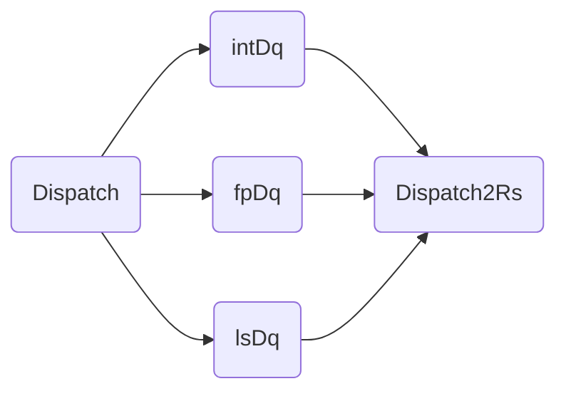

# 派遣
## Dispatch
在香山处理器中，派遣部分逻辑实际上共包括两级流水级:

第一级 Dispatch 负责将指令分类并发送至定点、浮点与访存三类派遣队列（Dispatch Queue

第二级 Dispatch2Rs 负责将对应类型的指令进一步根据不同的运算操作类型派遣至不同的保留站

Dispatch -> 三种DispatchQueue ：intDq, fpDq, lsDq -> Dispatch2Rs

## 参数
1. *DqSize : dispatch queue 的大小
2. *DeqWidth: 每一周期输出的指令数

> PS: EnqWidth == RenameWidth

## 算法
### Dispatch -> Dq 
出于时序考虑，原设计简化了指令可以继续进入下一级的条件：
1. 指令的去向：根据uop的FuType判断指令的去向
2. 阻塞的设计：没有被前面的指令阻塞住
3. 资源充足：当且仅当所有资源都是充足的（派遣队列有足够空项、ROB 有足够空项等）
### DispatchQueue
LIFO 的队列 包含了对于**robIdx**的判断
### Dispatch2Rs
两种不同的情况 Distinct 和 lessexu
1. Distinct

不会重叠

2. LessEXU

在分发过程中EXU会越来越少
## TODO
- redirect: 重定向
