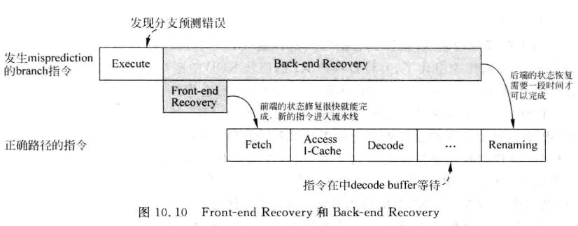

# 特殊情况的处理

## 分支预测失败的处理

### 前端

重命名前的阶段

1. 所有：抹掉所有指令
2. 分支预测：恢复历史状态表（GHR，BHR）等
3. 使用正确的指令重新取指

### 后端

1. 所有：抹掉内部组件的指令
2. 重命名：恢复RAT重命名映射表
3. ROB：释放错误的ROB空间
4. 物理寄存器：进行释放

Xiangshan 使用统一的PRF 两个重命名映射表，一个Rename时的（推测）重命名表，一个ROB中的正确重命名表。所以恢复过程是：

1. 抽干所有错误分支指令前的指令
2. 抹掉所有后端指令
3. 复制正确的RAT到Rename中
4. 开始取正确的指令开始执行

## 异常的处理

## 中断的处理
