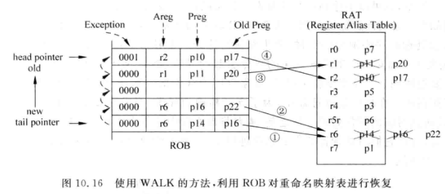

# 特殊情况的处理

## 分支预测失败的处理

### 前端

重命名前的阶段

1. 所有：抹掉所有指令
2. 分支预测：恢复历史状态表（GHR，BHR）等
3. 使用正确的指令重新取指

### 后端

1. 所有：抹掉内部组件的指令
2. 重命名：恢复RAT重命名映射表
3. ROB：释放错误的ROB空间
4. 物理寄存器：进行释放

Xiangshan 使用统一的PRF 两个重命名映射表，一个Rename时的（推测）重命名表，一个ROB中的正确重命名表。所以恢复过程是：

1. 抽干所有错误分支指令前的指令
2. 抹掉所有后端指令
3. 复制正确的RAT到Rename中
4. 开始取正确的指令开始执行

## 异常的处理
采用统一 PRF 进行重命名的架构

必须按照原有的顺序进行处理，所以最好使用重排序缓存(ROB)。

1. 在 retire 退休的时候进行异常的处理
2. 返回的情况
   1. 这一条指令： 例如 TLB 缺失异常
   2. 下一条指令： 例如 ecall 指令
3. 清空流水线，状态恢复
   1. WALK 使用 ROB 中旧的寄存器映射关系进行恢复 (硬件资源- RAT写端口的竞争)
4. RAT 相关的 FreeList 和 BusyTable 的恢复
   1. FreeList ：不会覆盖，在 利用 ROB 恢复 RAT 时，同时释放 FreeList
   2. BusyTable: 每从 ROB 恢复一条指令，就将目的寄存器置为无效

**异常与分支预测错误同时发生**时： Recovery at Retire 可以让跳过不需要处理的异常

## 中断的处理
